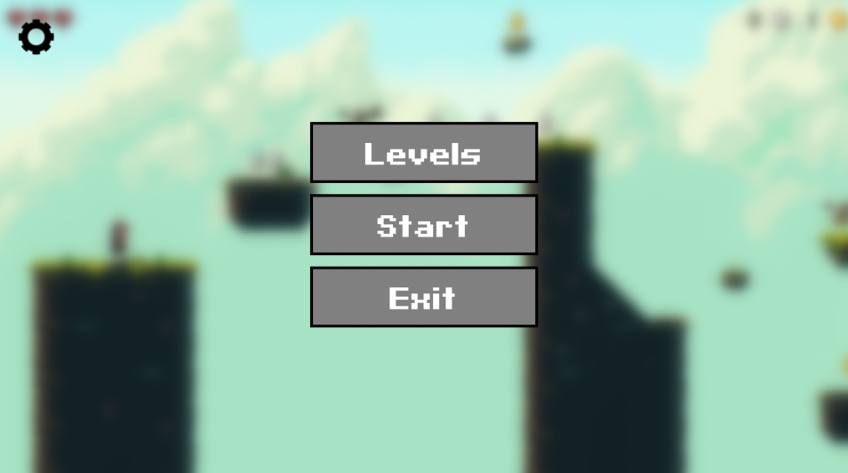
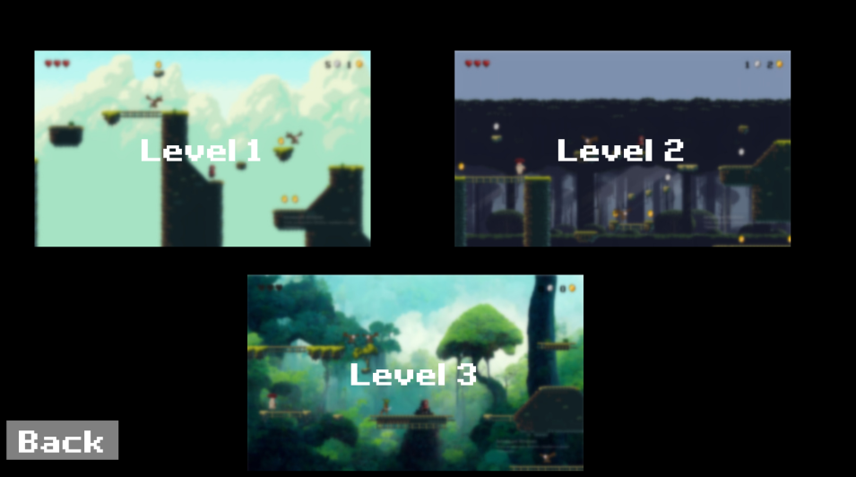
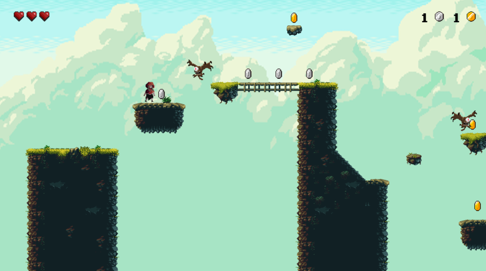
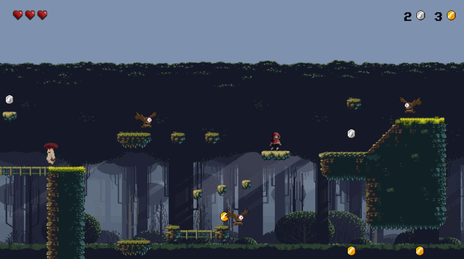
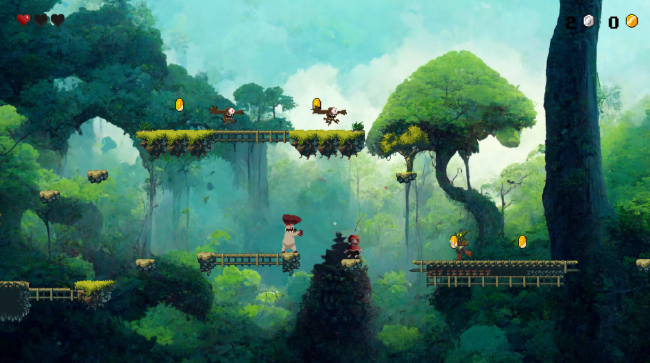

# Игра-платформер
Цель игры заключается в сражении с врагами, передвижении по платформам и собирании монет

### Управление

1. Передвижение
    - AD
    - "←" "→"
2. Прыжок
    - W
    - "↑"
3. Атака
    - F

### Меню

### Выбор уровней

### Уровень 1

### Уровень 2

### Уровень 3
